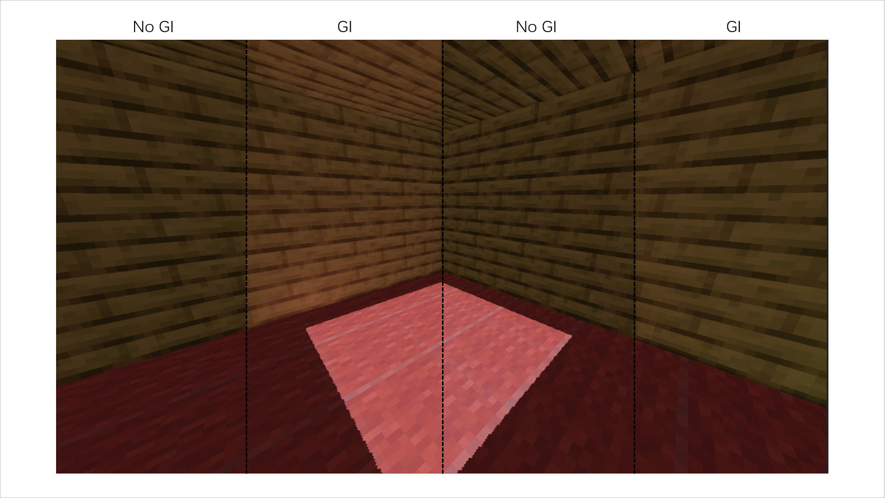

# Boundless Jovial Thriving Utopia Game Engine

> BJTU Game Engine, for short

## Preview

* Overview


* Water Reflection (using Screen Space Reflection)


* Cloud (using Ray Marching)


* Soft Shadow (using VSM)


* Simple Global Illumination (using RSM)



## Prerequisites

* C++ Compiler
  * GCC >= 13
  * Or, MSVC (Visual Studio >= 2022)
* CMake >= 3.19
* Git >= 2.1
* Python >= 3.9

## How to Build & Run

1. Clone the project and enter the directory

    ```
    git clone https://github.com/YXHXianYu/BJTU-Game-Engine.git
    cd BJTU-Game-Engine
    ```

2. Run the following command to build

    ```
    python ./scripts/glsl-preprocessor/glsl-preprocessor.py
    cmake . -B build
    cmake --build build -j16
    ```
    
    The binary `BJTU-Game-Engine` should be generated into the `bin` folder.
    
3. Run the binary.

### Just

Or, if you have [just](https://github.com/casey/just) installed, step 2~3 can be simply done by running:

```
just
```

> Check `justfile` or use `just -l` for more information.

## How to Control

* Movement
  * Use `WASD` for moving forward, backward, left, and right, respectively.
  * Use `QE` for moving up and down.
* Camera
  * Hold the right mouse button and drag to adjust the camera view.
* Window
  * Press `Escape` and `Enter` to exit the BJTU-Game-Engine
* Render
   * Press `Shift + K` to control whether to render the character
   * Press `Shift + J` to control whether to render the block
   * Press `Shift + L` to control whether to render the light mesh
   * Press `Shift + O` to control whether to use the orthogonal projection
   * Press `N` to switch water mode
   * Press `M` to switch FXAA mode
   * Press `,` to switch shadow mode
   * Press `R/T` to control the position of the sun
   * Press `Z/X` to control the thickness of the cloud
   * Press `C` to control whether to enable Reflective Shadow Map (Default Off)
     * You can also press `R/T` to observe the effect of RSM

## Contributors

<a href="https://github.com/yxhxianyu/bjtu-game-engine/graphs/contributors">
  
</a>

## License

BJTU Game Engine is open source software licensed as [MIT](./LICENSE).
