# config notes

* record some problem when I construct this project

## State 1

* fking cpp

### 1.1 Missing OpenGL Lib

* Problem
  * 
* Cause
  * link glfw but forget to OpenGL Lib
* Solution
  * add the following lines in CMakeLists.txt
  * 

### 1.2 MacOS Issue

* Problem

  * 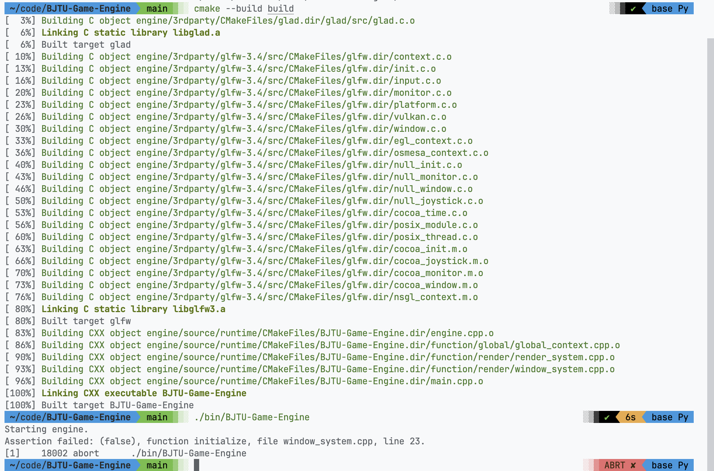

* Cause

  * ① Forget to invoke `glfwWindowHint(GLFW_OPENGL_FORWARD_COMPAT, GL_TRUE);` in MacOS
  * ② MacOS only supports OpenGL <= 4.1

* Solution

  * ① Add the above sentence in MacOS

    ```c++
    #ifdef __APPLE__
        glfwWindowHint(...)
    #endif
    ```

  * ② Change OpenGL version to 4.1

### 1.3 Fucking CMake

* Problem

  * shader precompile cmake script cannot produce right result
  * Correct：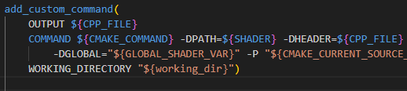
  * Wrong：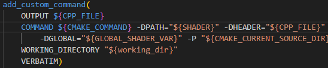

* Cause

  * cmake feature

* Solution

  * delete `VERBATIM`

  * 

    > By ChatGPT4

### 1.4 Texture All Black

* Problem
  * 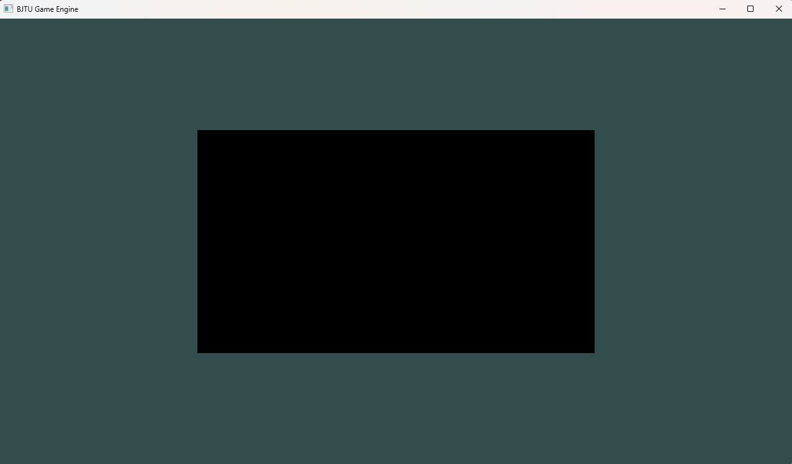
* Cause
  * C++析构函数用不好，导致资源被提前析构
  * RenderTexture类析构函数
    * 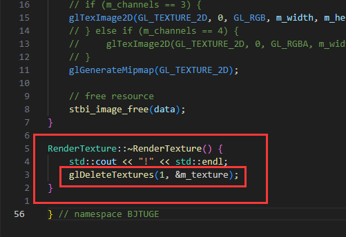
  * 初始化构造资源
    * 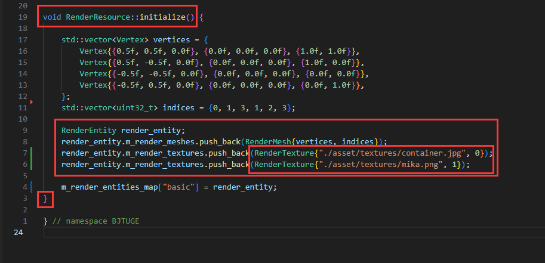
  * 这就导致：初始化构造资源时，就会调用RenderTexture析构函数，从而释放资源
  * **找了两个多小时！！！太痛苦了！**
* Solution
  * ① 不用析构函数了，自己重载一套（比如Unreal）
  * ② 质疑C++、理解C++、成为C++！使用C++特性 —— 智能指针，通过 `shared_ptr` 来管理RenderTexture等RAII资源。这样就可以在拷贝时只拷贝指针，避免析构函数被调用！

### 1.5 glGetProgramiv参数错误

* Problem
  * 在MacOS上，shader代码无误，但是程序报Program compile error
    * 并且MacOS上，没有编译的错误信息
    * 同一份代码，Windows系统上，编译正常
  * 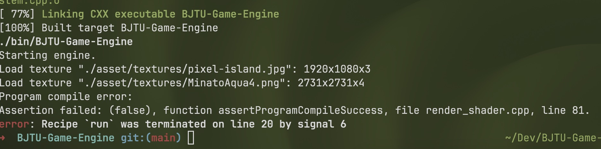
* Cause
  * 参数写错了
  * 错误：
  * 正确：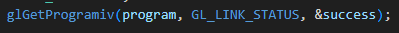
* Solution
  * 改成GL_LINK_STATUS就行了

## State 2

### 2.1 延迟渲染

* 盲写写了半天，把前向渲染一口气改成延迟渲染了
* Problem
  * preview：恐怖游戏渲染
  * 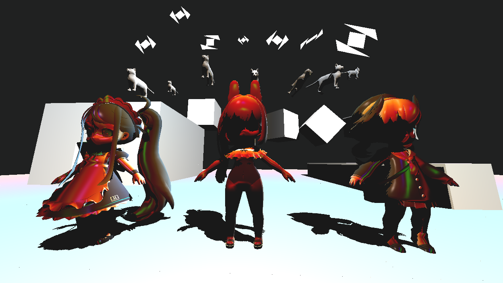
* Cause1
  * 修改架构的时候，location没对上，一个3写成4了
    * 错误：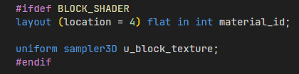
    * 正确：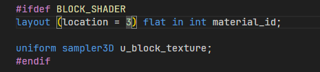
* Cause2
  * 人物模型进行Model Transform的时候，法线也需要一起变换！我忘记了，所以人物的法线是错误的（导致人物很暗）
  * 错误效果
    * 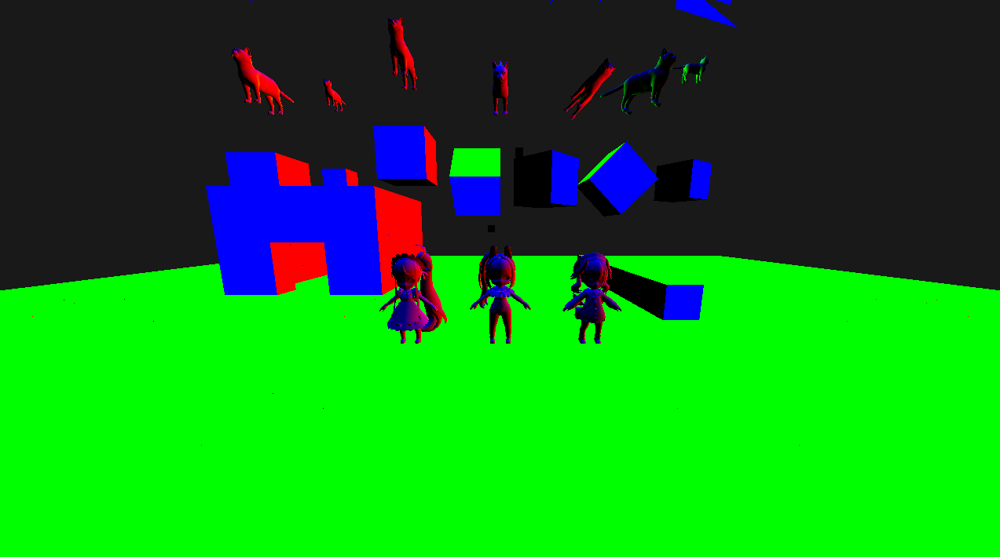
    * 可以注意到，背后旋转的方块，法线的方向是错误的！
  * 法线是向量，不能和点一样直接进行Model Transform，需要得到一个特殊的Normal Transform
  * $M_{normal} = ((M_{model})^{-1})^{T}$ 
  * 证明见我笔记
  * 正确效果
    * 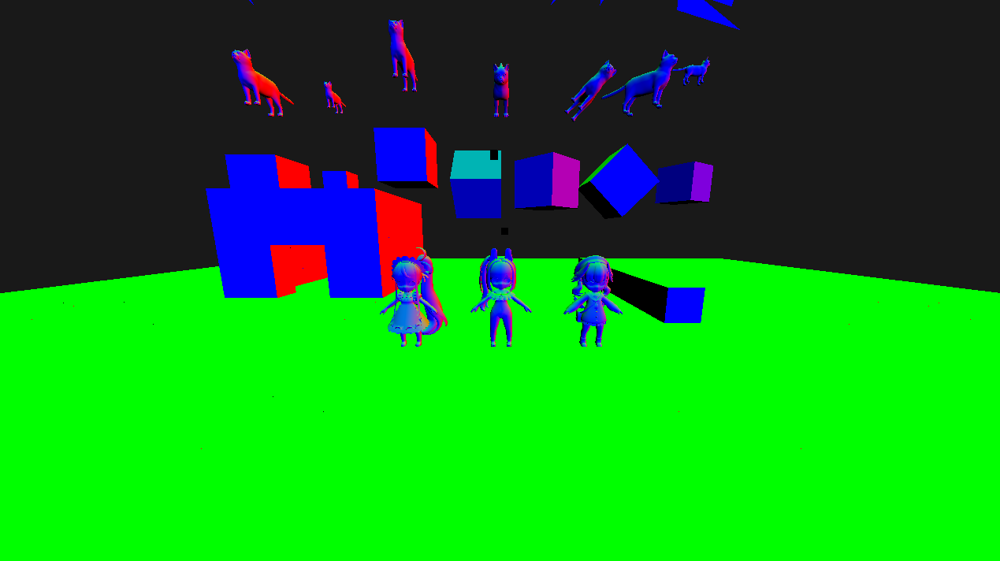
* Cause3
  * 画面偏灰（对比度低）
  * 错误效果
    * 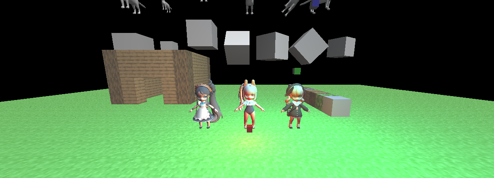
  * 原因是ambient没有考虑kd，所以相当于整个画面变亮，对比度就降低了，画面不好看
  * 正确效果
    * 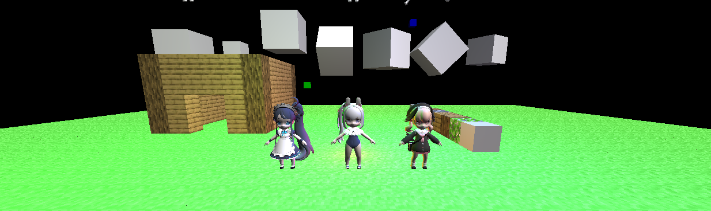
* Cause4
  * 高光怎么写都不对
  * 后面法线高光好像反了，你要和光源站在一起，才会出现高光
  * 后面发现GLSL的 **reflect** 函数的第一个参数是 表面点指向光源向量的 **负值**！
    * 竟然是负值！
  * 改完就对了，找了好久
* Cause...
  * 一大票错误
* 终于！
  * 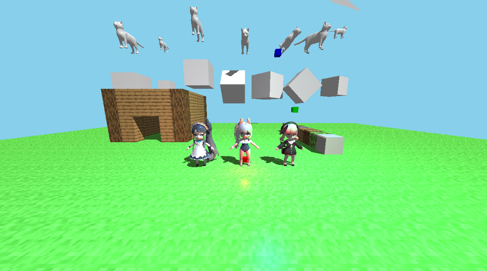